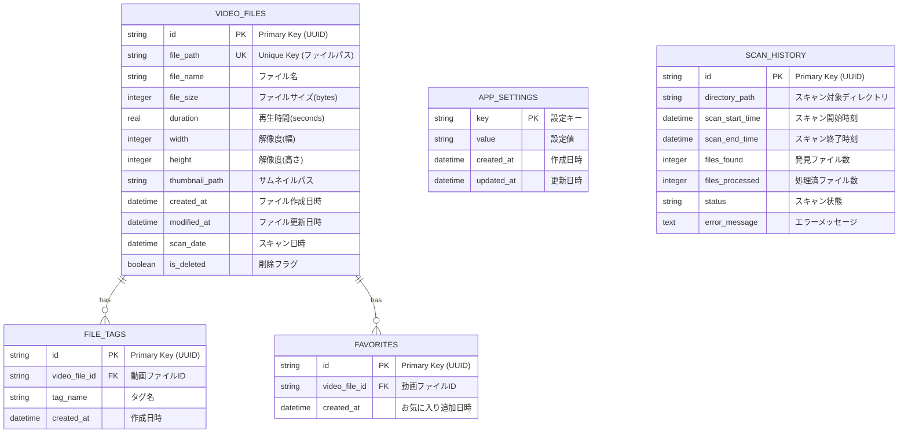

# MovieMonitor ER図

## エンティティ関係図



## テーブル詳細説明

### 1. VIDEO_FILES テーブル
**概要**: 動画ファイルの基本情報を格納するメインテーブル

| カラム名 | データ型 | 制約 | 説明 |
|---------|---------|-----|------|
| id | TEXT | PRIMARY KEY | ファイル識別子（UUID）|
| file_path | TEXT | UNIQUE, NOT NULL | ファイルの絶対パス |
| file_name | TEXT | NOT NULL | ファイル名（拡張子含む）|
| file_size | INTEGER | NOT NULL | ファイルサイズ（バイト単位）|
| duration | REAL | NOT NULL | 再生時間（秒単位、小数点可）|
| width | INTEGER | NOT NULL | 動画の幅（ピクセル）|
| height | INTEGER | NOT NULL | 動画の高さ（ピクセル）|
| thumbnail_path | TEXT | NULL可 | サムネイル画像のパス |
| created_at | DATETIME | NOT NULL | ファイルの作成日時 |
| modified_at | DATETIME | NOT NULL | ファイルの最終更新日時 |
| scan_date | DATETIME | NOT NULL | データベースへの登録日時 |
| is_deleted | BOOLEAN | DEFAULT FALSE | 論理削除フラグ |

**インデックス**:
- `idx_file_name ON video_files(file_name)` - ファイル名検索用
- `idx_file_size ON video_files(file_size)` - サイズフィルタリング用
- `idx_duration ON video_files(duration)` - 再生時間フィルタリング用
- `idx_scan_date ON video_files(scan_date)` - 最新順ソート用

### 2. APP_SETTINGS テーブル
**概要**: アプリケーションの設定情報を格納

| カラム名 | データ型 | 制約 | 説明 |
|---------|---------|-----|------|
| key | TEXT | PRIMARY KEY | 設定キー |
| value | TEXT | NOT NULL | 設定値（JSON文字列も可）|
| created_at | DATETIME | DEFAULT CURRENT_TIMESTAMP | 作成日時 |
| updated_at | DATETIME | DEFAULT CURRENT_TIMESTAMP | 更新日時 |

**設定例**:
- `scan_directories`: `["/Users/username/Videos", "/Users/username/Downloads"]`
- `thumbnail_size`: `320`
- `theme`: `dark`
- `last_scan_date`: `2024-01-15T10:30:00Z`

### 3. SCAN_HISTORY テーブル（将来拡張用）
**概要**: スキャン実行履歴を記録

| カラム名 | データ型 | 制約 | 説明 |
|---------|---------|-----|------|
| id | TEXT | PRIMARY KEY | スキャン履歴ID（UUID）|
| directory_path | TEXT | NOT NULL | スキャン対象ディレクトリ |
| scan_start_time | DATETIME | NOT NULL | スキャン開始時刻 |
| scan_end_time | DATETIME | NULL可 | スキャン終了時刻 |
| files_found | INTEGER | NOT NULL | 発見されたファイル数 |
| files_processed | INTEGER | NOT NULL | 正常に処理されたファイル数 |
| status | TEXT | NOT NULL | スキャン状態（running/completed/error）|
| error_message | TEXT | NULL可 | エラーメッセージ |

### 4. FILE_TAGS テーブル（将来拡張用）
**概要**: 動画ファイルへのタグ付け機能

| カラム名 | データ型 | 制約 | 説明 |
|---------|---------|-----|------|
| id | TEXT | PRIMARY KEY | タグID（UUID）|
| video_file_id | TEXT | FOREIGN KEY | 動画ファイルID |
| tag_name | TEXT | NOT NULL | タグ名 |
| created_at | DATETIME | DEFAULT CURRENT_TIMESTAMP | タグ作成日時 |

**インデックス**:
- `idx_video_file_tags ON file_tags(video_file_id)` - 動画ごとのタグ取得用
- `idx_tag_name ON file_tags(tag_name)` - タグ名検索用

### 5. FAVORITES テーブル（将来拡張用）
**概要**: お気に入り動画の管理

| カラム名 | データ型 | 制約 | 説明 |
|---------|---------|-----|------|
| id | TEXT | PRIMARY KEY | お気に入りID（UUID）|
| video_file_id | TEXT | FOREIGN KEY | 動画ファイルID |
| created_at | DATETIME | DEFAULT CURRENT_TIMESTAMP | お気に入り追加日時 |

**インデックス**:
- `idx_favorite_video ON favorites(video_file_id)` - 重複チェック用

## データ整合性制約

### 外部キー制約
```sql
-- FILE_TAGSテーブル
ALTER TABLE file_tags 
ADD CONSTRAINT fk_file_tags_video_file 
FOREIGN KEY (video_file_id) REFERENCES video_files(id) 
ON DELETE CASCADE;

-- FAVORITESテーブル  
ALTER TABLE favorites 
ADD CONSTRAINT fk_favorites_video_file 
FOREIGN KEY (video_file_id) REFERENCES video_files(id) 
ON DELETE CASCADE;
```

### チェック制約
```sql
-- ファイルサイズは正の値
ALTER TABLE video_files 
ADD CONSTRAINT chk_file_size_positive 
CHECK (file_size > 0);

-- 再生時間は0以上
ALTER TABLE video_files 
ADD CONSTRAINT chk_duration_non_negative 
CHECK (duration >= 0);

-- 解像度は正の値
ALTER TABLE video_files 
ADD CONSTRAINT chk_resolution_positive 
CHECK (width > 0 AND height > 0);
```

## データアクセスパターン

### 主要クエリ例

#### 1. ファイル名による部分検索
```sql
SELECT * FROM video_files 
WHERE file_name LIKE '%search_term%' 
AND is_deleted = FALSE
ORDER BY scan_date DESC;
```

#### 2. ファイルサイズと再生時間による絞り込み
```sql
SELECT * FROM video_files 
WHERE file_size BETWEEN 100000000 AND 1000000000  -- 100MB-1GB
AND duration BETWEEN 300 AND 7200                 -- 5分-2時間
AND is_deleted = FALSE
ORDER BY file_size DESC;
```

#### 3. 解像度グループ別集計
```sql
SELECT 
    CASE 
        WHEN width >= 1920 THEN 'Full HD以上'
        WHEN width >= 1280 THEN 'HD'
        ELSE 'SD'
    END as resolution_group,
    COUNT(*) as file_count,
    AVG(file_size) as avg_size
FROM video_files 
WHERE is_deleted = FALSE
GROUP BY resolution_group;
```

#### 4. 最近スキャンされたファイル
```sql
SELECT * FROM video_files 
WHERE scan_date > datetime('now', '-7 days')
AND is_deleted = FALSE
ORDER BY scan_date DESC
LIMIT 100;
```