# MovieMonitor クラス図

## システム全体クラス図

```mermaid
classDiagram
    %% メインプロセス層
    class MovieMonitorApp {
        -mainWindow: BrowserWindow
        -database: DatabaseManager
        -scanner: FileScanner
        -thumbnailGenerator: ThumbnailGenerator
        +initialize(): Promise~void~
        +createMainWindow(): Promise~void~
        +setupIPCHandlers(): void
        +shutdown(): Promise~void~
    }

    class DatabaseManager {
        -db: Database
        -dbPath: string
        +initialize(): Promise~void~
        +saveVideoFile(videoFile: VideoFile): Promise~void~
        +searchVideoFiles(filter: SearchFilter): Promise~VideoFile[]~
        +getVideoFile(id: string): Promise~VideoFile~
        +deleteVideoFile(id: string): Promise~void~
        +createTables(): Promise~void~
        +createIndexes(): Promise~void~
        -mapRowToVideoFile(row: any): VideoFile
    }

    class FileScanner {
        -supportedFormats: string[]
        -metadataExtractor: MetadataExtractor
        +scanDirectories(directories: string[]): Promise~VideoFile[]~
        +scanDirectory(directory: string): Promise~string[]~
        +processVideoFile(filePath: string): Promise~VideoFile~
        -countVideoFiles(directory: string): Promise~number~
        -generateFileId(filePath: string): string
        -isVideoFile(filePath: string): boolean
    }

    class MetadataExtractor {
        +extractMetadata(filePath: string): Promise~VideoMetadata~
        -parseFFProbeOutput(output: string): VideoMetadata
        -validateMetadata(metadata: any): boolean
    }

    class ThumbnailGenerator {
        -thumbnailDir: string
        +generateThumbnail(filePath: string, duration: number): Promise~string~
        +getThumbnailPath(filePath: string): string
        -getThumbnailFileName(filePath: string): string
        -ensureThumbnailDirectory(): void
        -fileExists(path: string): Promise~boolean~
    }

    class IPCHandler {
        -database: DatabaseManager
        -scanner: FileScanner
        -thumbnailGenerator: ThumbnailGenerator
        +setupHandlers(): void
        +handleScanVideos(event: IpcMainEvent, params: any): Promise~void~
        +handleSearchVideos(event: IpcMainEvent, filter: SearchFilter): Promise~void~
        +handleOpenVideo(event: IpcMainEvent, params: any): Promise~void~
        +handleMoveVideo(event: IpcMainEvent, params: any): Promise~void~
        +handleDeleteVideo(event: IpcMainEvent, params: any): Promise~void~
    }

    %% レンダラープロセス層
    class App {
        +render(): JSX.Element
    }

    class VideoProvider {
        -state: VideoState
        -dispatch: React.Dispatch~VideoAction~
        +children: React.ReactNode
        +render(): JSX.Element
    }

    class Header {
        +onScanClick(): void
        +onSettingsClick(): void
        +render(): JSX.Element
    }

    class SearchSection {
        -searchInput: string
        -filters: SearchFilter
        +onSearchChange(value: string): void
        +onFilterChange(filter: SearchFilter): void
        +onSearchSubmit(): void
        +render(): JSX.Element
    }

    class SearchInput {
        -value: string
        -placeholder: string
        +onChange(value: string): void
        +onSubmit(): void
        +render(): JSX.Element
    }

    class FilterPanel {
        -filters: SearchFilter
        +onFiltersChange(filters: SearchFilter): void
        +resetFilters(): void
        +render(): JSX.Element
    }

    class VideoGrid {
        -videos: VideoFile[]
        -isLoading: boolean
        +onVideoSelect(video: VideoFile): void
        +render(): JSX.Element
    }

    class VideoCard {
        -video: VideoFile
        -isSelected: boolean
        +onPlay(): void
        +onMove(): void
        +onDelete(): void
        +onContextMenu(): void
        +render(): JSX.Element
    }

    class VideoThumbnail {
        -src: string
        -alt: string
        -onLoad(): void
        -onError(): void
        +render(): JSX.Element
    }

    class VideoMetadata {
        -fileSize: number
        -duration: number
        -resolution: string
        +formatFileSize(bytes: number): string
        +formatDuration(seconds: number): string
        +render(): JSX.Element
    }

    class ActionButtons {
        -video: VideoFile
        +onPlay(): void
        +onMove(): void
        +onDelete(): void
        +render(): JSX.Element
    }

    class StatusBar {
        -totalCount: number
        -selectedCount: number
        -scanProgress: ScanProgress
        +render(): JSX.Element
    }

    %% カスタムフック
    class useVideoOperations {
        +scanVideos(directories?: string[]): Promise~void~
        +searchVideos(filter: SearchFilter): Promise~void~
        +openVideo(filePath: string): Promise~void~
        +moveVideo(from: string, to: string): Promise~void~
        +deleteVideo(filePath: string): Promise~void~
        +videos: VideoFile[]
        +isLoading: boolean
    }

    class useElectronAPI {
        +scanVideos(params: any): Promise~VideoFile[]~
        +searchVideos(filter: SearchFilter): Promise~VideoFile[]~
        +openVideo(params: any): Promise~boolean~
        +moveVideo(params: any): Promise~boolean~
        +deleteVideo(params: any): Promise~boolean~
    }

    %% ユーティリティ
    class FileUtils {
        +formatFileSize(bytes: number): string
        +formatDuration(seconds: number): string
        +getFileExtension(filePath: string): string
        +isValidVideoFile(filePath: string): boolean
        +sanitizeFilePath(path: string): string
    }

    class ValidationUtils {
        +validateVideoFile(video: VideoFile): boolean
        +validateSearchFilter(filter: SearchFilter): boolean
        +sanitizeUserInput(input: string): string
    }

    class ErrorHandler {
        +handle(error: unknown): void
        +createUserFriendlyMessage(error: Error): string
        +logError(error: Error, context: string): void
    }

    %% データ型・インターフェース
    class VideoFile {
        <<interface>>
        +id: string
        +filePath: string
        +fileName: string
        +fileSize: number
        +duration: number
        +width: number
        +height: number
        +thumbnailPath?: string
        +createdAt: Date
        +modifiedAt: Date
        +scanDate: Date
    }

    class SearchFilter {
        <<interface>>
        +query?: string
        +directories?: string[]
        +formats?: VideoFormat[]
        +minSize?: number
        +maxSize?: number
        +minDuration?: number
        +maxDuration?: number
    }

    class VideoMetadataType {
        <<interface>>
        +duration: number
        +width: number
        +height: number
        +bitrate: number
        +codec: string
    }

    class ScanProgress {
        <<interface>>
        +totalFiles: number
        +processedFiles: number
        +currentFile: string
        +percentage: number
    }

    class VideoState {
        <<interface>>
        +videos: VideoFile[]
        +filteredVideos: VideoFile[]
        +isLoading: boolean
        +searchFilter: SearchFilter
        +selectedVideo?: VideoFile
        +scanProgress?: ScanProgress
    }

    %% 関係性
    MovieMonitorApp --> DatabaseManager
    MovieMonitorApp --> FileScanner
    MovieMonitorApp --> ThumbnailGenerator
    MovieMonitorApp --> IPCHandler

    FileScanner --> MetadataExtractor
    IPCHandler --> DatabaseManager
    IPCHandler --> FileScanner
    IPCHandler --> ThumbnailGenerator

    App --> VideoProvider
    App --> Header
    App --> SearchSection
    App --> VideoGrid
    App --> StatusBar

    VideoProvider --> VideoState
    SearchSection --> SearchInput
    SearchSection --> FilterPanel
    VideoGrid --> VideoCard
    VideoCard --> VideoThumbnail
    VideoCard --> VideoMetadata
    VideoCard --> ActionButtons

    useVideoOperations --> useElectronAPI
    VideoCard --> useVideoOperations

    FileScanner ..> VideoFile : creates
    DatabaseManager ..> VideoFile : stores/retrieves
    SearchSection ..> SearchFilter : uses
    MetadataExtractor ..> VideoMetadataType : creates
    FileScanner ..> ScanProgress : reports
```



## 詳細クラス仕様

### メインプロセス層

#### MovieMonitorApp
```typescript
class MovieMonitorApp {
    private mainWindow: BrowserWindow | null = null;
    private database: DatabaseManager;
    private scanner: FileScanner;
    private thumbnailGenerator: ThumbnailGenerator;
    private ipcHandler: IPCHandler;

    constructor() {
        this.database = new DatabaseManager();
        this.scanner = new FileScanner(this.database);
        this.thumbnailGenerator = new ThumbnailGenerator();
        this.ipcHandler = new IPCHandler(this.database, this.scanner, this.thumbnailGenerator);
    }

    public async initialize(): Promise<void> {
        await this.database.initialize();
        await this.createMainWindow();
        this.ipcHandler.setupHandlers();
        this.setupAppEvents();
    }

    private async createMainWindow(): Promise<void> {
        this.mainWindow = new BrowserWindow({
            width: 1200,
            height: 800,
            minWidth: 800,
            minHeight: 600,
            webPreferences: {
                nodeIntegration: false,
                contextIsolation: true,
                preload: path.join(__dirname, 'preload.js')
            }
        });

        if (isDevelopment) {
            await this.mainWindow.loadURL('http://localhost:3000');
        } else {
            await this.mainWindow.loadFile('dist/index.html');
        }
    }

    private setupAppEvents(): void {
        app.on('window-all-closed', this.handleWindowAllClosed.bind(this));
        app.on('activate', this.handleActivate.bind(this));
    }

    public async shutdown(): Promise<void> {
        await this.database.close();
        if (this.mainWindow) {
            this.mainWindow.close();
        }
    }
}
```

#### DatabaseManager
```typescript
class DatabaseManager {
    private db: Database;
    private dbPath: string;

    constructor() {
        this.dbPath = path.join(app.getPath('userData'), 'moviemonitor.db');
    }

    public async initialize(): Promise<void> {
        this.db = new Database(this.dbPath);
        this.db.pragma('journal_mode = WAL');
        this.db.pragma('foreign_keys = ON');
        
        await this.createTables();
        await this.createIndexes();
        await this.migrateIfNeeded();
    }

    public saveVideoFile(videoFile: VideoFile): Promise<void> {
        return new Promise((resolve, reject) => {
            const transaction = this.db.transaction(() => {
                const stmt = this.db.prepare(`
                    INSERT OR REPLACE INTO video_files 
                    (id, file_path, file_name, file_size, duration, width, height, 
                     thumbnail_path, created_at, modified_at, scan_date)
                    VALUES (?, ?, ?, ?, ?, ?, ?, ?, ?, ?, ?)
                `);
                
                stmt.run([
                    videoFile.id,
                    videoFile.filePath,
                    videoFile.fileName,
                    videoFile.fileSize,
                    videoFile.duration,
                    videoFile.width,
                    videoFile.height,
                    videoFile.thumbnailPath,
                    videoFile.createdAt.toISOString(),
                    videoFile.modifiedAt.toISOString(),
                    videoFile.scanDate.toISOString()
                ]);
            });

            try {
                transaction();
                resolve();
            } catch (error) {
                reject(error);
            }
        });
    }

    public async searchVideoFiles(filter: SearchFilter): Promise<VideoFile[]> {
        let query = 'SELECT * FROM video_files WHERE is_deleted = FALSE';
        const params: any[] = [];

        // フィルター条件の構築
        if (filter.query) {
            query += ' AND file_name LIKE ?';
            params.push(`%${filter.query}%`);
        }

        if (filter.minSize !== undefined) {
            query += ' AND file_size >= ?';
            params.push(filter.minSize);
        }

        if (filter.maxSize !== undefined) {
            query += ' AND file_size <= ?';
            params.push(filter.maxSize);
        }

        if (filter.minDuration !== undefined) {
            query += ' AND duration >= ?';
            params.push(filter.minDuration);
        }

        if (filter.maxDuration !== undefined) {
            query += ' AND duration <= ?';
            params.push(filter.maxDuration);
        }

        if (filter.formats && filter.formats.length > 0) {
            const formatConditions = filter.formats.map(() => 'file_name LIKE ?').join(' OR ');
            query += ` AND (${formatConditions})`;
            filter.formats.forEach(format => {
                params.push(`%.${format}`);
            });
        }

        query += ' ORDER BY scan_date DESC';

        const stmt = this.db.prepare(query);
        const rows = stmt.all(params);
        
        return rows.map(row => this.mapRowToVideoFile(row));
    }

    private mapRowToVideoFile(row: any): VideoFile {
        return {
            id: row.id,
            filePath: row.file_path,
            fileName: row.file_name,
            fileSize: row.file_size,
            duration: row.duration,
            width: row.width,
            height: row.height,
            thumbnailPath: row.thumbnail_path,
            createdAt: new Date(row.created_at),
            modifiedAt: new Date(row.modified_at),
            scanDate: new Date(row.scan_date)
        };
    }
}
```

### レンダラープロセス層

#### VideoProvider
```typescript
interface VideoState {
    videos: VideoFile[];
    filteredVideos: VideoFile[];
    isLoading: boolean;
    searchFilter: SearchFilter;
    selectedVideo: VideoFile | null;
    scanProgress: ScanProgress | null;
    error: string | null;
}

type VideoAction =
    | { type: 'SET_VIDEOS'; payload: VideoFile[] }
    | { type: 'SET_LOADING'; payload: boolean }
    | { type: 'SET_SEARCH_FILTER'; payload: SearchFilter }
    | { type: 'SET_SELECTED_VIDEO'; payload: VideoFile | null }
    | { type: 'SET_SCAN_PROGRESS'; payload: ScanProgress | null }
    | { type: 'SET_ERROR'; payload: string | null };

const VideoProvider: React.FC<{ children: React.ReactNode }> = ({ children }) => {
    const [state, dispatch] = useReducer(videoReducer, initialState);

    const contextValue = useMemo(() => ({
        state,
        dispatch
    }), [state, dispatch]);

    return (
        <VideoContext.Provider value={contextValue}>
            {children}
        </VideoContext.Provider>
    );
};
```

#### VideoCard
```typescript
interface VideoCardProps {
    video: VideoFile;
    isSelected?: boolean;
    onSelect?: (video: VideoFile) => void;
}

const VideoCard: React.FC<VideoCardProps> = ({ 
    video, 
    isSelected = false, 
    onSelect 
}) => {
    const { openVideo, moveVideo, deleteVideo } = useVideoOperations();
    const [contextMenuVisible, setContextMenuVisible] = useState(false);

    const handlePlay = useCallback(async () => {
        try {
            await openVideo(video.filePath);
        } catch (error) {
            console.error('Failed to open video:', error);
        }
    }, [openVideo, video.filePath]);

    const handleMove = useCallback(async () => {
        const newPath = await window.electronAPI.selectDirectory();
        if (newPath) {
            try {
                await moveVideo(video.filePath, newPath);
            } catch (error) {
                console.error('Failed to move video:', error);
            }
        }
    }, [moveVideo, video.filePath]);

    const handleDelete = useCallback(async () => {
        const confirmed = await window.electronAPI.showMessageBox({
            type: 'question',
            message: 'このファイルを削除しますか？',
            buttons: ['削除', 'キャンセル'],
            defaultId: 1
        });

        if (confirmed.response === 0) {
            try {
                await deleteVideo(video.filePath);
            } catch (error) {
                console.error('Failed to delete video:', error);
            }
        }
    }, [deleteVideo, video.filePath]);

    const handleContextMenu = useCallback((event: React.MouseEvent) => {
        event.preventDefault();
        setContextMenuVisible(true);
    }, []);

    return (
        <div 
            className={`video-card ${isSelected ? 'selected' : ''}`}
            onClick={() => onSelect?.(video)}
            onContextMenu={handleContextMenu}
            data-testid="video-card"
        >
            <VideoThumbnail 
                src={video.thumbnailPath} 
                alt={video.fileName}
                onDoubleClick={handlePlay}
            />
            <div className="video-info">
                <h3 className="video-title" title={video.fileName}>
                    {video.fileName}
                </h3>
                <VideoMetadata 
                    fileSize={video.fileSize}
                    duration={video.duration}
                    resolution={`${video.width}x${video.height}`}
                />
            </div>
            <ActionButtons 
                onPlay={handlePlay}
                onMove={handleMove}
                onDelete={handleDelete}
            />
            {contextMenuVisible && (
                <ContextMenu 
                    onPlay={handlePlay}
                    onMove={handleMove}
                    onDelete={handleDelete}
                    onClose={() => setContextMenuVisible(false)}
                />
            )}
        </div>
    );
};
```

#### useVideoOperations
```typescript
const useVideoOperations = () => {
    const { state, dispatch } = useContext(VideoContext)!;
    const electronAPI = useElectronAPI();

    const scanVideos = useCallback(async (directories?: string[]) => {
        dispatch({ type: 'SET_LOADING', payload: true });
        dispatch({ type: 'SET_ERROR', payload: null });
        
        try {
            // プログレス監視の開始
            electronAPI.onScanProgress((progress: ScanProgress) => {
                dispatch({ type: 'SET_SCAN_PROGRESS', payload: progress });
            });

            const videos = await electronAPI.scanVideos({ directories });
            dispatch({ type: 'SET_VIDEOS', payload: videos });
            dispatch({ type: 'SET_SCAN_PROGRESS', payload: null });
        } catch (error) {
            const errorMessage = error instanceof Error ? error.message : '不明なエラーが発生しました';
            dispatch({ type: 'SET_ERROR', payload: errorMessage });
            console.error('Failed to scan videos:', error);
        } finally {
            dispatch({ type: 'SET_LOADING', payload: false });
        }
    }, [electronAPI, dispatch]);

    const searchVideos = useCallback(async (filter: SearchFilter) => {
        dispatch({ type: 'SET_SEARCH_FILTER', payload: filter });
        dispatch({ type: 'SET_LOADING', payload: true });
        dispatch({ type: 'SET_ERROR', payload: null });
        
        try {
            const videos = await electronAPI.searchVideos(filter);
            dispatch({ type: 'SET_VIDEOS', payload: videos });
        } catch (error) {
            const errorMessage = error instanceof Error ? error.message : '検索に失敗しました';
            dispatch({ type: 'SET_ERROR', payload: errorMessage });
            console.error('Failed to search videos:', error);
        } finally {
            dispatch({ type: 'SET_LOADING', payload: false });
        }
    }, [electronAPI, dispatch]);

    const openVideo = useCallback(async (filePath: string) => {
        try {
            await electronAPI.openVideo({ filePath });
        } catch (error) {
            console.error('Failed to open video:', error);
            throw error;
        }
    }, [electronAPI]);

    const moveVideo = useCallback(async (from: string, to: string) => {
        try {
            const result = await electronAPI.moveVideo({ from, to });
            if (result) {
                // ステート更新
                const updatedVideos = state.videos.map(video =>
                    video.filePath === from
                        ? { ...video, filePath: to, fileName: path.basename(to) }
                        : video
                );
                dispatch({ type: 'SET_VIDEOS', payload: updatedVideos });
            }
            return result;
        } catch (error) {
            console.error('Failed to move video:', error);
            throw error;
        }
    }, [electronAPI, state.videos, dispatch]);

    const deleteVideo = useCallback(async (filePath: string) => {
        try {
            const result = await electronAPI.deleteVideo({ filePath });
            if (result) {
                // ステートから削除
                const updatedVideos = state.videos.filter(
                    video => video.filePath !== filePath
                );
                dispatch({ type: 'SET_VIDEOS', payload: updatedVideos });
            }
            return result;
        } catch (error) {
            console.error('Failed to delete video:', error);
            throw error;
        }
    }, [electronAPI, state.videos, dispatch]);

    return {
        videos: state.videos,
        isLoading: state.isLoading,
        searchFilter: state.searchFilter,
        selectedVideo: state.selectedVideo,
        scanProgress: state.scanProgress,
        error: state.error,
        scanVideos,
        searchVideos,
        openVideo,
        moveVideo,
        deleteVideo
    };
};
```

## クラス設計原則

### 単一責任原則 (SRP)
- 各クラスは単一の責任を持つ
- `DatabaseManager`: データベース操作のみ
- `FileScanner`: ファイルスキャンのみ
- `ThumbnailGenerator`: サムネイル生成のみ

### 開放閉鎖原則 (OCP)  
- 拡張に開放、変更に閉鎖
- `MetadataExtractor`: 新しいメタデータ形式への対応が容易
- `VideoCard`: 新しいアクション追加が容易

### 依存性逆転原則 (DIP)
- 抽象に依存、具象に依存しない
- IPCHandler は具体的なクラスではなくインターフェースに依存

### 関心の分離
- メインプロセスとレンダラープロセスの明確な分離
- UI層とビジネスロジック層の分離